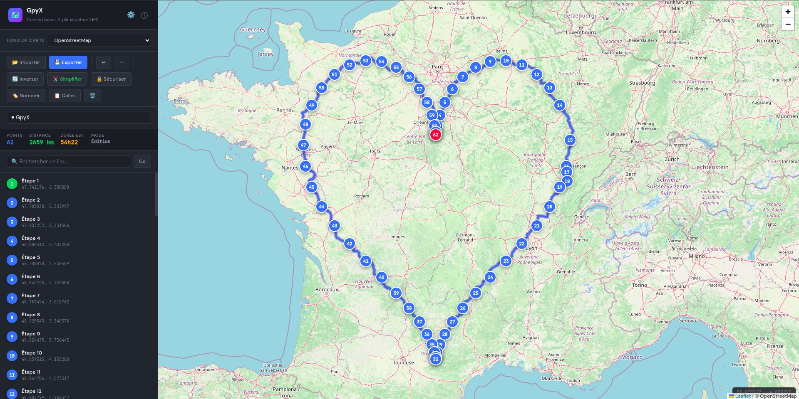

[🇬🇧 English](README.md) | 🇫🇷 Français

# GpyX 🗺️

> ⚠️ **Alpha — stade précoce, pour passionnés.** Des bugs sont possibles. Vos retours sont les bienvenus.

**Convertisseur & planificateur de routes GPS — 17 formats, zéro dépendance, tourne dans votre navigateur.**

> Vous utilisiez ITN Converter (ITNConv) et il vous manque ? C'est pour vous.



---

## Démarrage rapide

```bash
python3 server.py
```

Ouvre `http://localhost:8080` dans votre navigateur. Pas de `pip install`, pas de Docker, pas de clé API.

**Pré-requis :** Python 3.8+

---

## C'est quoi GpyX ?

GpyX est un outil GPS open source et auto-hébergé qui fait bien deux choses :

**1. Convertir tout vers tout.** Vous avez un `.itn` de TomTom, un `.kml` de Google Earth, un `.gpx` de Garmin, un `.csv` d'un tableur ? GpyX lit et écrit 17 formats GPS. Glissez-déposez un fichier, récupérez-le au format de votre appareil.

**2. Planifier et éditer des itinéraires visuellement.** Cliquez sur la carte pour poser des étapes. Déplacez-les. Obtenez le routage OSRM avec distance et durée. Simplifiez les traces Calimoto ou Garmin en itinéraires propres. Exportez vers votre GPS.

### Fonctionnalités

- 📋 **Coller des coordonnées** dans 12 syntaxes — décimal, DMS, URLs Google Maps, Apple Maps, Waze, geo: URI, Plus Codes
- ⛰️ **Profil altimétrique** le long de l'itinéraire
- 🏷️ **Nommage automatique** — géocodage inverse, numérotation séquentielle, nommage relatif avec points d'ancrage
- ⚓ **Ancres** — protègent les étapes clés de la simplification, de la sécurisation et du renommage en masse
- 🔒 **Verrouillage de nom** — gèle le nom d'une étape à travers toutes les opérations
- 🔁 **Annuler/Refaire** avec historique complet
- 🌍 **12 fonds de carte** — OSM, satellite, topographique, vélo, mode sombre…
- 👻 **Trace fantôme** — superpose la trace originale après simplification
- 📏 **Sécurisation d'itinéraire** — rééchantillonne à intervalles fixes pour les GPS nécessitant des points denses

---

## Formats (17 en lecture, 18 en écriture)

| Format | Ext | L | É | Utilisé par |
|--------|-----|:-:|:-:|-------------|
| GPX | .gpx | ✓ | ✓ | Garmin, Strava, Komoot, la plupart des GPS |
| ITN | .itn | ✓ | ✓ | TomTom |
| KML | .kml | ✓ | ✓ | Google Earth, Google My Maps |
| CSV | .csv | ✓ | ✓ | Tableurs, outils divers |
| GeoJSON | .geojson | ✓ | ✓ | Cartographie web, développeurs |
| OV2 | .ov2 | ✓ | ✓ | TomTom POI |
| RTE | .rte | ✓ | ✓ | OziExplorer Route |
| PLT | .plt | ✓ | ✓ | OziExplorer Track |
| WPT | .wpt | ✓ | ✓ | OziExplorer Waypoint |
| RT2 | .rt2 | ✓ | ✓ | OziExplorer Route v2 |
| BCR | .bcr | ✓ | ✓ | Marco Polo / MotoPlaner |
| OSM | .osm | ✓ | ✓ | OpenStreetMap XML |
| LMX | .lmx | ✓ | ✓ | Nokia Landmarks |
| DAT | .dat | ✓ | ✓ | Navigon / Destinator |
| TK | .tk | ✓ | ✓ | CompeGPS / TwoNav |
| LOC | .loc | — | ✓ | Geocaching |
| URL | .url | ✓ | — | URL Google Maps |

---

## Ligne de commande

```bash
python3 itnconv.py input.gpx output.itn           # Conversion
python3 itnconv.py route.kml out.itn out.csv       # Multi-sortie
python3 itnconv.py track.gpx clean.itn --reverse   # Inverser le sens
python3 itnconv.py --info route.gpx                # Infos sur le fichier
python3 itnconv.py --formats                       # Lister les formats
```

## Bibliothèque Python

```python
from itnconv_py import convert, read_file, write_file

convert("route.gpx", "route.itn")

arrays = read_file("track.gpx")
route = arrays[0]
route.reverse()
route.douglas_peucker(100)  # Simplification à 100m
write_file("clean.kml", route)
```

---

## Architecture

```
gpyx/
├── server.py      354 lignes — Serveur web + API
├── index.html    1795 lignes — Interface carte (Leaflet, JS vanilla)
├── itnconv.py     212 lignes — CLI
├── models.py      290 lignes — GpsPoint, GpsRoute, Douglas-Peucker
├── formats.py    1267 lignes — 17 lecteurs + 18 écrivains
├── __init__.py     31 lignes — Interface bibliothèque
└── README.md
```

**~4000 lignes au total.** Pas de framework, pas de build, pas de node_modules.

---

## Services externes

GpyX est autonome pour la conversion de fichiers. L'interface web appelle optionnellement des services libres et gratuits :

| Service | Rôle | Obligatoire ? |
|---------|------|---------------|
| [OpenStreetMap](https://www.openstreetmap.org) | Tuiles cartographiques | Oui (affichage carte) |
| [OSRM Demo](https://router.project-osrm.org) | Calcul d'itinéraire | Non |
| [Nominatim](https://nominatim.org) | Recherche d'adresses & nommage | Non |
| [OpenTopoData](https://www.opentopodata.org) | Profil altimétrique | Non |

Sans internet, GpyX convertit les fichiers et permet de placer des étapes manuellement.

---

## Pourquoi GpyX ?

**ITN Converter est mort.** Le site a disparu, l'API Google Maps qu'il utilisait exige désormais une clé payante. La dernière version (1.94) circule encore sur les forums, mais la recherche et le routage ne fonctionnent plus.

**GpyX prend la relève :**

- **Web** — Mac, Linux, téléphone, tablette. Pas de .exe Windows.
- **Aucune dépendance à une API payante** — construit sur OpenStreetMap, pas Google Maps.
- **Open source (AGPL-3.0)** — forkez, corrigez, étendez.
- **Auto-hébergé** — vos itinéraires restent sur votre machine.

---

## Contribuer

Projet personnel. Issues et PR bienvenues, notamment pour :

- Nouveaux formats GPS (Sygic, CoPilot, Waze…)
- Améliorations de l'interface
- Traductions au-delà de FR/EN
- Rapports de bugs avec de vrais fichiers GPS

---

## Crédits

Logique de conversion inspirée de [ITN Converter v1.94](https://github.com/Benichou34/itnconverter) par Benichou Software (licence MIT). Réécrit entièrement en Python.

Construit avec [Leaflet](https://leafletjs.com), [OSRM](https://project-osrm.org), [Nominatim](https://nominatim.org). Données cartographiques © contributeurs [OpenStreetMap](https://www.openstreetmap.org/copyright).

## Avertissement

Ce logiciel est fourni en l'état, sans aucune garantie. GpyX est un outil de conversion et de planification, pas un système de navigation. **Vérifiez toujours vos itinéraires avant de rouler.** Un fichier GPS — aussi bien préparé soit-il — est une suggestion, pas une certitude. La route reste votre seul guide fiable. Restez vigilant, faites confiance à vos yeux, et roulez prudemment.

## Licence

[AGPL-3.0](LICENSE)
